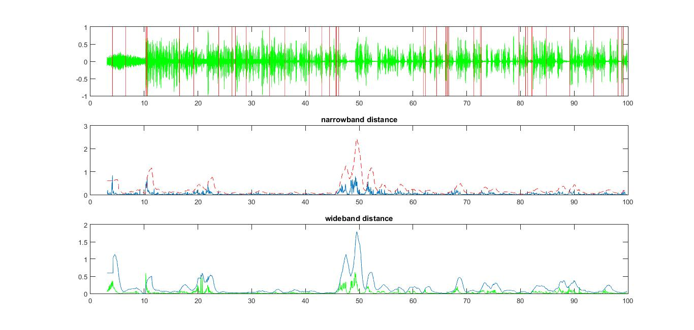

## Speech Segmentation ##
 
#### This project was about marking the transition of speaker in active news debate.</b>

  <b>_Features Used were narrowband and wideband fft coefficients._</b>

Main code is projectdsp all others are supporting functions

Details have been explained in code itself.

#### Output Plot

Virtual Red Lines in plot1 shows transition points in speech.

We used dynamic thresholding and dotted red line in plot2 and blue line in plot3 shows threshold value for respective bhattacharyya distance. 